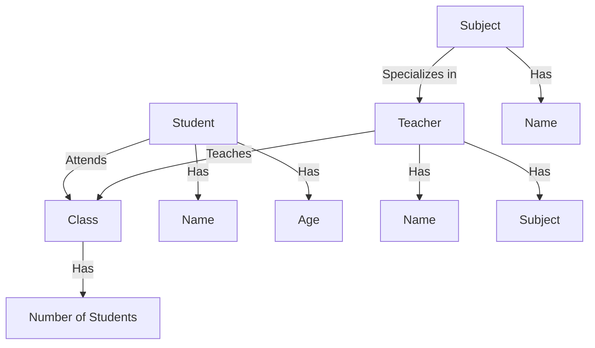
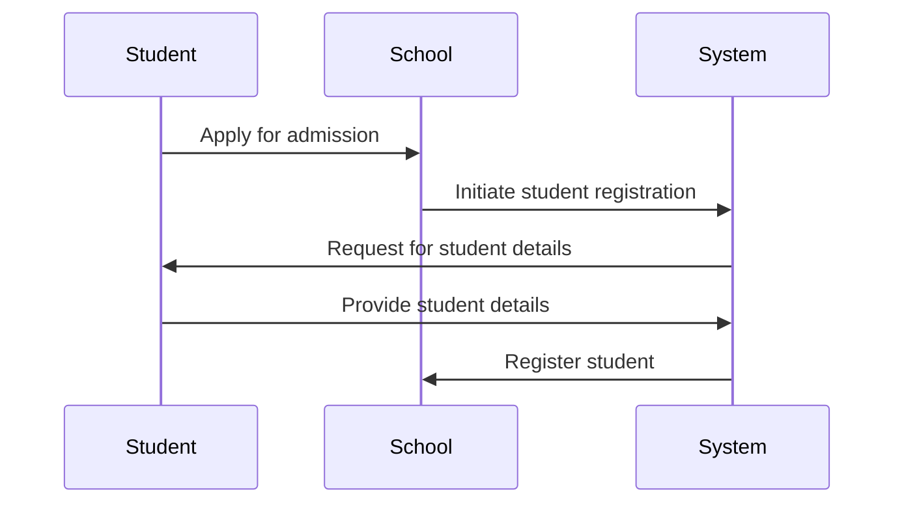
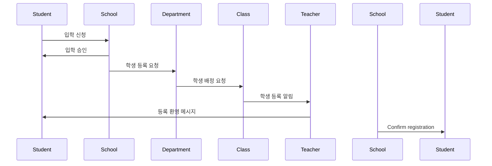

## 시나리오 
학교 시스템을 DB로 만들고 싶습니다. 
학년은 총 1학년부터 6학년까지 있으며 한 반에 학생은 30명이 있습니다.  한 학년당 반의 수는 조금씩 다르지만 4~6개 정도가 있습니다. 각 반에는 선생님이 담임 선생님으로 있으며 선생님들은 각 주요과목을 하나씩 담당하고 있습니다. 이 학교에서 다루는 주요 과목은 "수학" "국어" "영어" "체육" "음악" "과학" "사회" "도덕" 입니다. 

## ERD 

```mermaid
erDiagram
    STUDENT ||--o{ CLASS : "attends" 
    TEACHER ||--o{ CLASS : "teaches"
    SUBJECT ||--o{ TEACHER : "specializes in"
    GRADE ||--o{ CLASS : "has"
    CLASS {
        string name
        int number_of_students
    }
    STUDENT {
        string name
        int age
    }
    TEACHER {
        string name
        string subject
    }
    SUBJECT {
        string name
    }
    GRADE {
        int level
    }
```

## DFD 
- https://gist.github.com/jiyeonseo/078ae7056e8521a35426e7c276ac756d


## Sequence Diagram 



